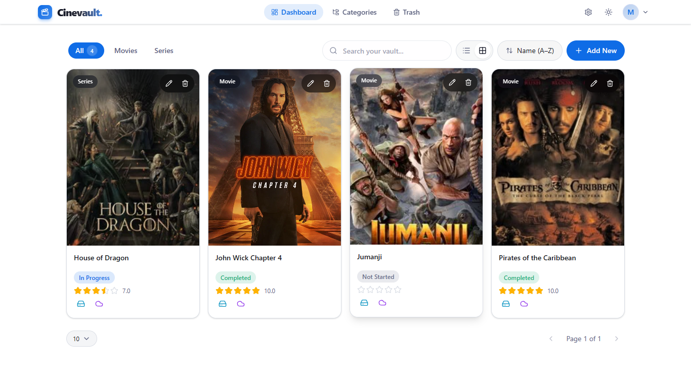

<div align="center">

# 🎬 CineVault

**Your personal movie and series vault track what you're watching, where it's stored, and what it deserves.**

[](https://nextjs.org/)
[](https://www.typescriptlang.org/)
[](https://convex.dev/)
[](https://tailwindcss.com/)
[](https://react.dev/)
[](LICENSE)
[](https://miangee-cinevault.vercel.app)

[Overview](#overview) · [Tech Stack](#tech-stack) · [Folder Structure](#project-structure-overview) · [Features](#core-features)  · [Getting Started](#local-development)

</div>



## Overview

**CineVault** is a personal media vault built for one purpose: to give cinephiles and binge-watchers a unified, intelligent system to organize, track, and manage their movie and series collections.

From casual viewers to serious collectors, CineVault centralizes your entertainment library in one professional workspace. It bridges the gap between personal collection management and actionable viewing insights without feeling like a heavy enterprise dashboard.

Whether you're tracking movies across multiple storage locations, managing series progress across seasons, or building thematic collections with custom categories — CineVault gives you the tools to take control of your media ecosystem.

---

## Why CineVault

CineVault solves a real problem: most people own impressive collections of movies and series, but struggle to organize them, track progress, remember ratings, and know where files are stored across their devices.

| Problem | CineVault's Solution |
| --- | --- |
| Movies and series scattered across drives, clouds, and devices | Centralized media intelligence with custom categories & subcategories |
| No clear tracking of what you've watched | Progress tracking for both movies and multi-season series |
| Lost track of ratings and personal thoughts | Integrated review system with star ratings |
| Storage chaos — copies on hard drives and clouds | Dual storage tracking (hard drive + cloud) with flexible descriptions |
| Large collections become impossible to browse | Natural sorting, powerful search, and multiple view modes |
| Accidental deletion of important titles | Soft delete with restore and permanent deletion workflows |
| Can't remember viewing status across series | Per-season and per-episode progress tracking for series |
| Generic categories don't fit your taste | Custom icon selection for personalized category organization |

---

## Tech Stack

| Layer | Stack |
| --- | --- |
| Frontend | Next.js 16, App Router, React 19, Tailwind CSS v4, shadcn/ui |
| State & Forms | Zustand, React Hook Form, Zod validation |
| Backend | Convex (real-time DB, Auth, file storage, background mutations) |
| Storage | Cloudinary for poster/cover images |
| Icons | Lucide React for comprehensive icon set |
| UI Framework | Base UI, Radix UI primitives |
| Developer Experience | TypeScript, ESLint, Strict type checking |

---

## Project Structure Overview

```text
cinevault/
├── .github/
│   └── assets/
│       └── hero.png                             # Hero image for README
├── .next/                                       # Local Next.js build output
├── convex/
│   ├── _generated/
│   │   ├── api.d.ts                             # Generated Convex API types
│   │   ├── api.js                               # Generated Convex API client
│   │   ├── dataModel.d.ts                       # Type-safe database schema
│   │   ├── server.d.ts                          # Generated server types
│   │   └── server.js                            # Generated server runtime
│   ├── appSettings.ts                           # Admin settings & signup toggle
│   ├── auth.config.ts                           # Convex auth configuration
│   ├── auth.ts                                  # Auth actions & signup logic
│   ├── categories.ts                            # Category CRUD operations
│   ├── http.ts                                  # HTTP endpoints & routing
│   ├── mediaItemMutations.ts                    # Create/update/delete mutations
│   ├── mediaItemQueries.ts                      # Queries with pagination & search
│   ├── schema.ts                                # Database schema & indexes
│   ├── storage.ts                               # File storage operations
│   ├── subcategories.ts                         # Subcategory CRUD logic
│   ├── trash.ts                                 # Soft-delete, restore workflows
│   ├── users.ts                                 # User management logic
│   └── tsconfig.json                            # Convex TypeScript config
├── src/
│   ├── app/
│   │   ├── (auth)/
│   │   │   ├── layout.tsx                       # Auth layout wrapper
│   │   │   ├── login/
│   │   │   │   └── page.tsx                    # Login page
│   │   │   └── signup/
│   │   │       └── page.tsx                    # Signup page
│   │   ├── (dashboard)/
│   │   │   ├── layout.tsx                      # Dashboard shell & navbar
│   │   │   ├── admin/
│   │   │   │   └── settings/
│   │   │   │       └── page.tsx                # Admin settings panel
│   │   │   ├── categories/
│   │   │   │   └── page.tsx                    # Category management
│   │   │   ├── dashboard/
│   │   │   │   └── page.tsx                    # Main dashboard view
│   │   │   ├── item/
│   │   │   │   └── [id]/
│   │   │   │       └── page.tsx                # Media detail page
│   │   │   └── trash/
│   │   │       └── page.tsx                    # Trash/recycle bin UI
│   │   ├── error.tsx                           # Global error boundary
│   │   ├── globals.css                         # Global theme & styles
│   │   ├── layout.tsx                          # Root app layout
│   │   ├── not-found.tsx                       # 404 page
│   │   ├── page.tsx                            # Landing/redirect page
│   │   └── providers.tsx                       # App-wide context providers
│   ├── features/
│   │   ├── auth/
│   │   │   ├── components/
│   │   │   │   ├── LoginForm.tsx               # Login form component
│   │   │   │   └── SignupForm.tsx              # Signup form component
│   │   │   ├── hooks/
│   │   │   │   ├── useAuthActions.ts           # Auth mutations wrapper
│   │   │   │   ├── useCurrentUser.ts           # Current user data hook
│   │   │   │   ├── useIsAdmin.ts               # Admin check hook
│   │   │   │   └── useSignupEnabled.ts         # Signup availability hook
│   │   │   └── types.ts                        # Auth Zod schemas
│   │   ├── categories/
│   │   │   ├── components/
│   │   │   │   ├── CategoryCard.tsx            # Category display card
│   │   │   │   ├── CategoryFormDialog.tsx      # Create/edit dialog
│   │   │   │   ├── CategoryList.tsx            # List view layout
│   │   │   │   ├── IconGlyph.tsx               # Icon renderer
│   │   │   │   ├── IconPicker.tsx              # Icon selection modal
│   │   │   │   ├── SubcategoryFormDialog.tsx   # Subcategory form
│   │   │   │   └── SubcategoryList.tsx         # Nested list view
│   │   │   ├── hooks/
│   │   │   │   ├── useCategories.ts            # Fetch categories
│   │   │   │   └── useSubcategories.ts         # Fetch subcategories
│   │   │   └── types.ts                        # Category model types
│   │   ├── media-items/
│   │   │   ├── components/
│   │   │   │   ├── dashboard/                  # Dashboard view components
│   │   │   │   ├── detail/                     # Detail page components
│   │   │   │   └── form/                       # Create/edit form components
│   │   │   ├── hooks/
│   │   │   │   ├── useColumnWidths.ts          # Resize state management
│   │   │   │   ├── useCreateMediaItem.ts       # Create mutation
│   │   │   │   ├── useDeleteMediaItem.ts       # Soft delete mutation
│   │   │   │   ├── useFormStepper.ts           # Multi-step form state
│   │   │   │   ├── useMediaItem.ts             # Single item fetch
│   │   │   │   ├── useMediaItems.ts            # Paginated list fetch
│   │   │   │   └── useUpdateMediaItem.ts       # Update mutation
│   │   │   ├── utils/
│   │   │   │   ├── calculateProgress.ts        # Progress calculation helpers
│   │   │   │   ├── formatDuration.ts           # Duration formatting (HH:MM:SS)
│   │   │   │   └── sortMediaItems.ts           # Sort option definitions
│   │   │   └── types.ts                        # Media item Zod schemas
│   │   ├── ratings/
│   │   │   └── components/
│   │   │       └── StarRatingInput.tsx         # 5-star rating input
│   │   ├── theme/
│   │   │   ├── ThemeProvider.tsx               # Dark/light theme provider
│   │   │   └── components/
│   │   │       └── ThemeToggle.tsx             # Theme switcher button
│   │   └── trash/
│   │       ├── components/
│   │       │   ├── EmptyTrashDialog.tsx        # Confirm empty trash
│   │       │   ├── TrashActionDialogs.tsx      # Restore/delete actions
│   │       │   ├── TrashedMediaGridCard.tsx    # Grid view card
│   │       │   ├── TrashedMediaTab.tsx         # Tab navigation
│   │       │   ├── TrashedMediaTableRow.tsx    # List view row
│   │       │   ├── TrashHeader.tsx             # Trash header controls
│   │       │   └── ...                         # Additional trash components
│   │       └── hooks/
│   │           ├── useEmptyTrash.ts            # Empty all trash
│   │           ├── useHardDeleteAction.ts      # Permanent delete
│   │           ├── useRestoreAction.ts         # Restore from trash
│   │           └── useTrashedMediaItems.ts     # Fetch trashed items
│   ├── shared/
│   │   ├── components/
│   │   │   ├── ConfirmDialog.tsx               # Reusable confirmation modal
│   │   │   ├── CustomScrollbar.tsx             # Styled scrollbar
│   │   │   ├── EmptyState.tsx                  # Empty state UI
│   │   │   ├── Navbar.tsx                      # Top navigation
│   │   │   ├── SearchBar.tsx                   # Search input component
│   │   │   └── ui/
│   │   │       └── ...                         # shadcn/radix primitives
│   │   ├── hooks/
│   │   │   ├── useDashboardPreferences.ts      # View preferences store
│   │   │   └── useDebounce.ts                  # Debounce utility
│   │   └── lib/
│   │       └── utils.ts                        # Shared utility functions
│   └── proxy.ts                                # API proxy middleware
├── .gitignore                                   # Git ignore rules
├── components.json                              # shadcn/ui config
├── eslint.config.mjs                            # ESLint configuration
├── LICENSE                                      # MIT license
├── next-env.d.ts                                # Next.js env types
├── next.config.ts                               # Next.js configuration
├── package.json                                 # Dependencies & scripts
├── package-lock.json                            # Dependency lock file
├── postcss.config.mjs                           # PostCSS/Tailwind config
├── README.md                                    # Project documentation
├── tsconfig.json                                # Root TypeScript config
└── .env.local                                   # Local env (not committed)
```

### Architecture Highlights

- **convex/**: Backend foundation with schema, auth, mutations, queries, and background scheduling
- **src/app/**: Next.js App Router for auth flows, dashboard layout, and main pages
- **src/features/**: Feature-sliced architecture with co-located UI, hooks, and types for scalability
- **src/shared/**: Reusable components, utilities, and cross-feature state
- **Zod Schemas**: Validation for forms and database operations throughout the app

---

## Core Features

### 1. Dual Media Type Support

CineVault treats movies and series as first-class citizens with different data models. Movies track total duration and viewing progress in minutes. Series organize content by season with per-episode tracking, allowing you to manage multi-season content naturally.

- Unified interface for both movies and series
- Movie-specific fields: duration, progress tracking
- Series-specific fields: seasons, episodes, season-based progress
- Flexible status tracking (not started, in progress, completed)
- Natural progress visualization for both content types

### 2. Hierarchical Category System

Organize your collection with custom categories and subcategories. Whether you want to organize by genre, language, decade, mood, or any custom scheme — CineVault lets you build the hierarchy that matches your thinking.

- Unlimited category depth (categories + subcategories)
- Custom icons for visual recognition
- Automatic item counting per category
- Multi-category assignment for flexible organization
- Search-optimized for fast discovery

### 3. Dual Storage Tracking

Know exactly where your content lives. CineVault tracks both hard drive and cloud storage locations separately, with optional descriptions so you remember which drive, which cloud service, or which device stores each title.

- Track items on hard drives and cloud simultaneously
- Storage descriptions for location specificity
- Identify single-location content at a glance
- Plan backups and redundancy with confidence
- Mix and match storage locations per item

### 4. Integrated Rating & Review System

Give your movies and series the spotlight they deserve. Rate content on a 5-star scale and attach personal reviews to remember your thoughts, identify favorites, and curate themed playlists.

- 5-star rating system for all media
- Rich text reviews tied to each item
- Sort and filter by ratings
- Identify personal favorites instantly
- Export-ready for sharing with friends

### 5. Progress Tracking for Movies & Series

Never lose track of where you left off. Movies track duration viewed in seconds. Series track season and episode progress, allowing you to manage multi-season watches without confusion.

- Real-time progress updates for movies (HH:MM:SS)
- Per-season and per-episode tracking for series
- Optional progress descriptions for notes
- Status management (not started, in progress, completed)
- Visual progress indicators in list and grid views

### 6. Natural Lexicographical Sorting

CineVault sorts content in a human-friendly way. Numbers sort naturally (1, 2, 10, 11 instead of 1, 10, 2, 11), and sorting is stable across all views. This is powered by hidden zero-padded `sortTitle` values in the database for consistent, efficient ordering.

- Human-friendly number sorting
- Stable A-Z and numeric ordering
- Consistent across all view modes
- No more "Season 10" appearing before "Season 2"

### 7. Advanced Browsing & Pagination

Browse your collection with style. CineVault supports both grid and list views, draggable column sizing for custom layouts, and efficient pagination for large datasets. State is rendered on-the-fly instead of stored in loops, keeping the interface responsive and performant.

- Flexible grid and list view modes
- Customizable column widths with drag-to-resize
- Efficient pagination for massive collections
- Adaptive layouts for different screen sizes
- Smooth transitions between views

### 8. Powerful Search & Filtering

Find exactly what you're looking for, fast. Full-text search across all titles, with optional category and subcategory filtering to narrow results instantly.

- Real-time full-text search across titles
- Filter by category and subcategory
- Sort by name, rating, and other fields
- Combined search and filter workflows
- Optimized search indexes for speed

### 9. Robust Recycle Bin

Delete with confidence. CineVault implements a soft-delete system where items move to trash instead of disappearing. Restore them whenever you want, or permanently delete to free space. Large deletion and restoration operations are handled via Convex background scheduling to avoid transaction limits.

- Soft delete for all media items
- Trash bin with easy restore
- Permanent hard delete when ready
- Background processing for bulk operations
- Zero data loss on accidental deletion

### 10. Admin Security & Access Control

Control who can access your vault. CineVault includes Convex Auth with admin controls to manage signup access. Keep your deployment private by default, and only open registration when you decide.

- Built-in authentication with Convex Auth
- Admin-only dashboard for configuration
- Toggle public signup on/off in-app
- Secure, private-first defaults
- User isolation and data protection

---

## Local Development

### 1) Clone and Install

```bash
git clone https://github.com/yourusername/cinevault
cd cinevault
npm install
```

### 2) Start the Convex Backend

```bash
npx convex dev
```

This initializes your local Convex deployment, sets up the database, and configures auth. Leave this running in a separate terminal.

### 3) Set Up Convex Auth

```bash
npx @convex-dev/auth
```

This generates and stores the necessary auth environment variables for your local Convex deployment.

### 4) Set the Admin Email

```bash
npx convex env set ADMIN_EMAIL=your@email.com
```

Replace `your@email.com` with your email to gain access to the admin settings panel.

### 5) Run the Development Server

In a second terminal:

```bash
npm run dev
```

Open [http://localhost:3000](http://localhost:3000) in your browser.

---

## Production Deployment

### 1) Deploy the Convex Backend

```bash
npx convex deploy
```

This pushes your schema, queries, mutations, and auth configuration to production.

### 2) Configure Production Auth

```bash
npx @convex-dev/auth --prod
```

This generates production auth secrets and keys.

### 3) Set Production Environment Variables

```bash
npx convex env set ADMIN_EMAIL your@email.com --prod
npx convex env set CONVEX_SITE_URL https://your-app.vercel.app --prod
```

### 4) Deploy to Vercel

1. Connect your repository to Vercel
2. Add these environment variables in Vercel settings:
   - `CONVEX_DEPLOYMENT` — your production deployment ID

3. Deploy the application

### 5) Verify in Production

- Test the auth flow (login/signup)
- Verify category and media item management
- Test search and filtering
- Confirm progress tracking works
- Check admin settings panel access

---

## Project Summary

CineVault is a modern personal media management system designed for anyone who wants clarity, control, and joy over their movie and series collection. It combines the structure of a media library with the intelligence of a progress tracker and the beauty of a personal dashboard.

Built for long-term use, secure deployment, and thoughtful UX, CineVault respects your content and your time.

---

## License

This project is licensed under the **MIT License**.

See [LICENSE](LICENSE) for complete terms and conditions.

---

<p align="center">
  Built with care by <a href="https://github.com/miangee21">Muhammad Hassan</a>
</p>
