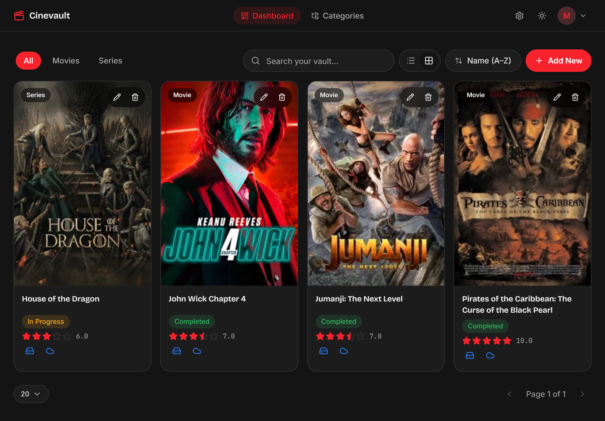
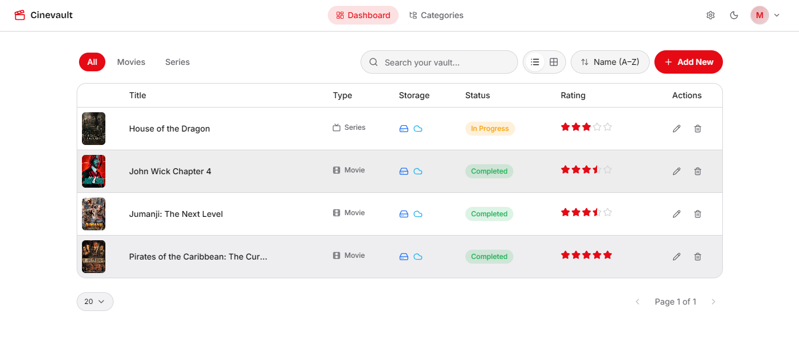
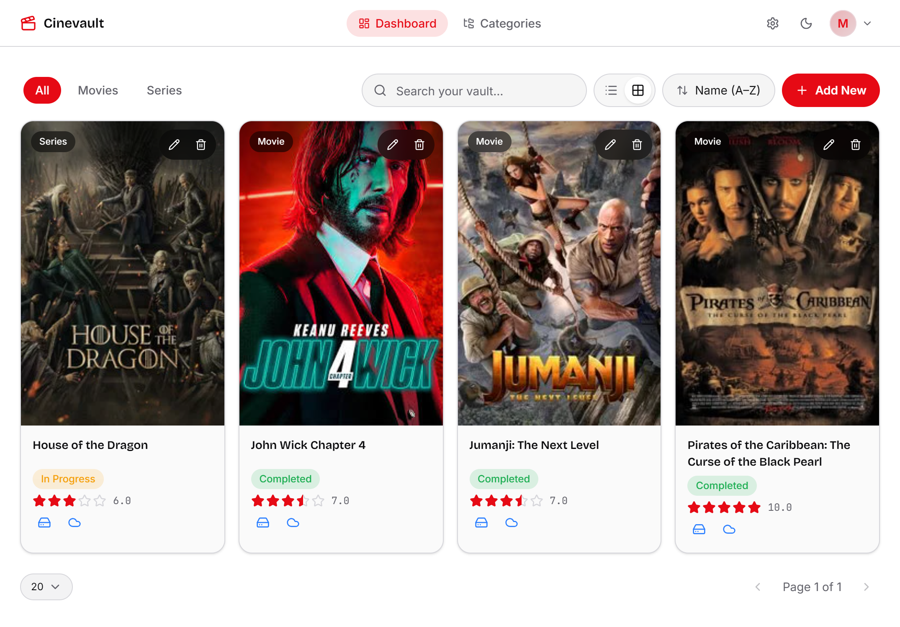
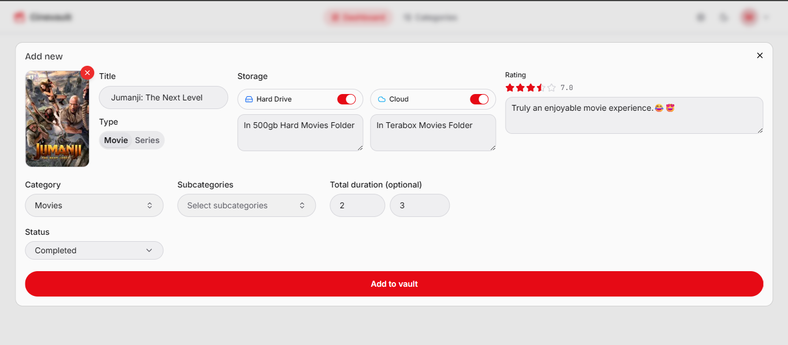
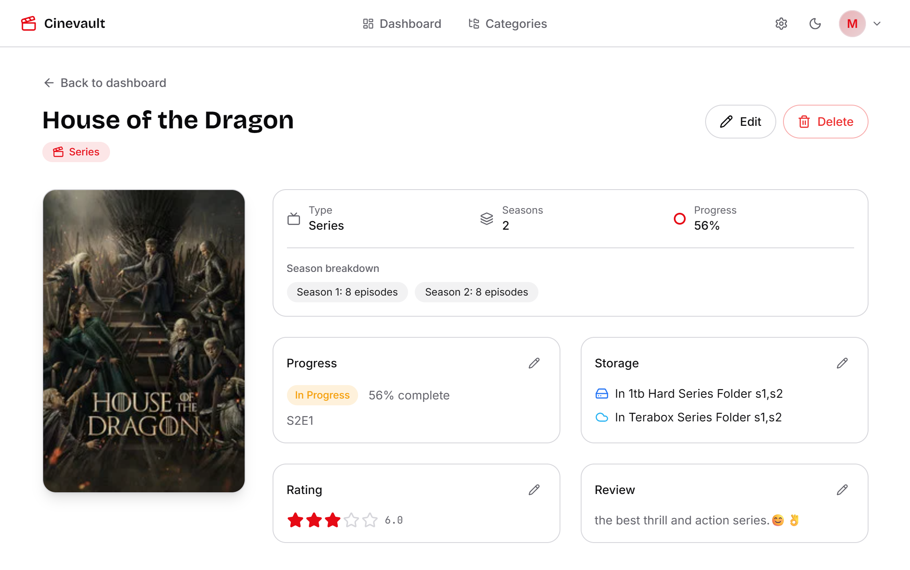
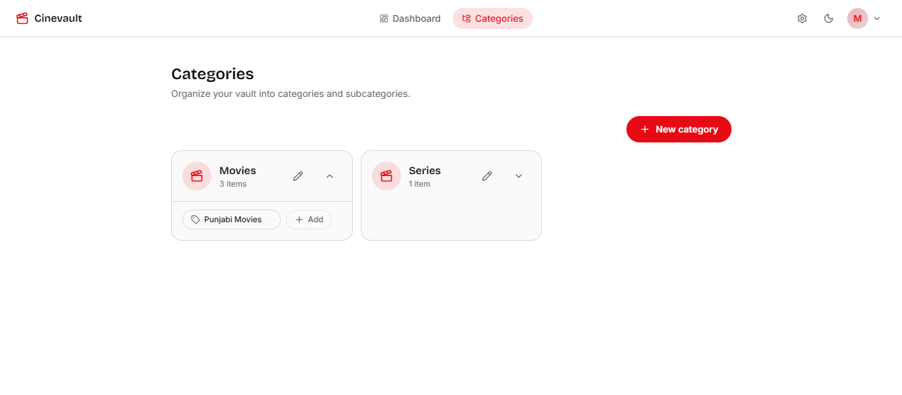
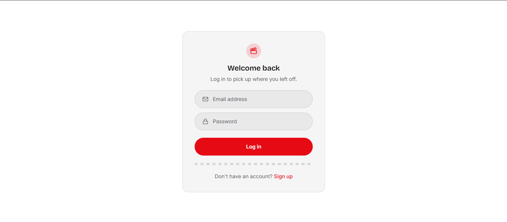

<div align="center">



# 🎬 Cinevault

**Your personal movie & series vault. Track what you watch, where it lives, and what it deserves.**

[](https://nextjs.org/)
[](https://www.typescriptlang.org/)
[](https://convex.dev/)
[](https://tailwindcss.com/)
[](https://cloudinary.com/)
[](./LICENSE)
[](https://miangee-cinevault.vercel.app)

[Features](#-features) · [Tech Stack](#-tech-stack) · [Screenshots](#-screenshots) · [Self-Hosting](#-self-hosting-guide) · [Folder Structure](#-folder-structure) · [Contributing](#-contributing)

</div>

---

## About

Cinevault is a full-stack Personal media tracker for movies and series, built for people who juggle a real archive across hard drives. cloud storage, and half-finished watchlists, and are tired of spreadsheets. Every category is yours to define, every field is optional until you're ready to fill it in, and the whole interface is built around getting information in and out fast: pill inputs, inline editors, keyboard-friendly dialogs, and zero unnecessary clicks.

It's fully open source. Fork it, Self-host it, reshape it. It's designed to be forkable from day one. with no vendor lock-in beyond the three free-tier services it runs on, and a feature-based codebase that's meant to be read, not just run.

---

## ✨ Features

### Authentication
- Email + password signup and login (Convex Auth, password-only — no OAuth complexity)
- Full route protection via middleware — logged-out users can't reach the dashboard, logged-in users can't linger on auth pages
- Live inline validation (name length, email format, password strength) before a single request is sent
- Show/hide toggle on every password field, on both login and signup
- Admin-only signup lock — a hidden settings page, visible only to the account matching `ADMIN_EMAIL`, lets you disable new signups site-wide with one switch, enforced server-side so it can't be bypassed from the browser. Perfect for turning a shared deployment into a single-user private vault

### Categories & Subcategories
- Fully custom, user-defined categories — not hardcoded "Movies/Series," build your own taxonomy
- Nested subcategories per category (e.g. *Series → Anime*, *Series → K-Drama*)
- Curated 60+ icon picker with live search, powered by Lucide
- Safe deletion with impact warnings — deleting a category that still has items in it automatically reassigns them to a lazily-created "Uncategorized" bucket instead of silently orphaning your data; deleting a subcategory shows exactly how many items will be affected first

### Media Tracking
- Movies and series live in one unified system, differentiated by type, each with fields tailored to how you actually track them
- **Movies:** total duration, and — once marked "In Progress" — how far into it you are, both as free text and as structured minutes for automatic percentage calculation
- **Series:** a dynamic season/episode builder (add as many seasons as the show has), current season + episode tracking, and time-within-episode notes
- Poster upload straight to Cloudinary, signed server-side so your API secret never touches the browser
- Independent Hard Drive / Cloud storage toggles, each with its own free-text location note (*"samsung-hard-1tb in Movies/Action"*)
- Half-star precision rating (0.5–10, displayed as 5 stars) plus a full-text review
- Full-text search across your entire vault by title, scoped privately to your account

### Dashboard
- Sortable, resizable, drag-to-resize table columns that remember your exact layout across sessions
- Toggle between a dense List view and a poster-forward Grid view — your choice persists
- Category tabs that gracefully scroll with arrow controls once you have more categories than fit on screen
- Cursor-based pagination with a full page-size selector (10 / 20 / 30 / 50 / 100 / All)
- Debounced search-across-everything, clearly labeled when it's overriding your current category filter
- Optional per-row delete button, toggle it on or off from a settings menu in the navbar — your choice, remembered
- macOS Finder–style alternating row tinting

### Item Detail Page
- Four fully independent inline editors — Progress, Storage, Rating, and Review each save on their own, no need to open one giant edit form for a one-field change
- Full edit and delete flows, delete asks for confirmation and cleans up the poster from Cloudinary automatically so nothing orphans your storage quota
- Season-by-season breakdown view for series, automatic progress-percentage display for both formats

### Design System
- Fully themable — every color is a CSS variable, light and dark mode both fully supported, zero hardcoded hex codes anywhere in the codebase
- Pill-shaped inputs and buttons throughout, solid (non-glassmorphic) surfaces by design
- Custom typography pairing — a bold display face for headings, a dense-legible face for the data-heavy table, and a monospace face for numeric/tracked data
- A signature film-sprocket motif used sparingly as a section divider

---

## 🖼 Screenshots


| Dashboard (List view) | Dashboard (Grid view) |
|---|---|
|  |  |

| Add / Edit Item | Item Detail Page |
|---|---|
|  |  |

| Categories | Login |
|---|---|
|  |  |

---

## 🧱 Tech Stack

| Layer | Technology |
|---|---|
| Framework | [Next.js 16](https://nextjs.org/) (App Router, Turbopack) |
| Language | TypeScript |
| Styling | [Tailwind CSS v4](https://tailwindcss.com/) + [shadcn/ui](https://ui.shadcn.com/) (Base UI primitives) |
| Backend & Database | [Convex](https://convex.dev/) — real-time reactive queries, mutations, and full-text search |
| Auth | [Convex Auth](https://labs.convex.dev/auth) (Password provider) |
| Image Hosting | [Cloudinary](https://cloudinary.com/) (signed direct uploads) |
| Forms & Validation | React Hook Form + Zod |
| Deployment | [Vercel](https://vercel.com/) (frontend) + Convex Cloud (backend) |

---

## 📁 Folder Structure

```
cinevault/
├── convex/                        # Backend: schema, queries, mutations, actions
│   ├── schema.ts                  # Database schema (categories, subcategories, mediaItems, auth)
│   ├── auth.ts / auth.config.ts   # Convex Auth configuration
│   ├── categories.ts              # Category CRUD + cascade-safe delete
│   ├── subcategories.ts           # Subcategory CRUD
│   ├── mediaItems.ts              # Media item CRUD + paginated search
│   ├── cloudinary.ts              # Signed upload + delete actions ("use node")
│   ├── users.ts                   # Current user lookup
│   ├── appSettings.ts             # Global app settings (admin-controlled signup toggle)
│   └── http.ts                    # Convex Auth HTTP routes
│
├── src/
│   ├── app/                       # Next.js App Router
│   │   ├── (auth)/                # /login, /signup — public routes
│   │   ├── (dashboard)/           # /dashboard, /categories, /item/[id], /admin/settings — protected routes
│   │   ├── layout.tsx             # Root layout: fonts, providers, toaster
│   │   ├── providers.tsx          # Convex + Theme providers
│   │   ├── not-found.tsx          # Themed 404 page
│   │   └── page.tsx               # "/" → redirects based on auth state
│   ├── proxy.ts                   # Route protection middleware
│   │
│   ├── features/                  # Feature-based modules — self-contained, own components/hooks/types
│   │   ├── auth/
│   │   ├── categories/
│   │   ├── media-items/
│   │   │   ├── components/
│   │   │   │   ├── dashboard/     # Table, grid, sort, search, pagination
│   │   │   │   ├── detail/        # Item detail page + inline editors
│   │   │   │   └── form/          # Create/edit dialog + all its sub-fields
│   │   │   ├── hooks/
│   │   │   └── utils/             # calculateProgress, formatDuration, ratingToStars, sortMediaItems
│   │   ├── ratings/
│   │   └── theme/
│   │
│   └── shared/
│       ├── components/
│       │   ├── ui/                # shadcn-generated primitives
│       │   ├── ConfirmDialog.tsx  # Reusable confirm/destructive action dialog
│       │   ├── EmptyState.tsx
│       │   └── Navbar.tsx
│       ├── hooks/                 # useDebounce, useDashboardPreferences
│       └── lib/                   # cn() utility
│
└── public/
    └── screenshots/                # README images live here
```

Every feature folder owns its own components, hooks, and types — nothing in `features/` reaches into another feature directly, keeping each one independently readable and replaceable.

---

## 🚀 Self-Hosting Guide

You can have your own instance running in about 15 minutes. You'll need free accounts on **Convex**, **Cloudinary**, and **Vercel** (or run it purely locally without Vercel at all).

### 1. Clone and install

```bash
git clone https://github.com/miangee21/cinevault
cd cinevault
npm install
```

### 2. Set up Convex

```bash
npx convex dev
```
- This opens a browser to log in / create a free Convex account.
- Choose **Create a new project**.
- This generates your `convex/` deployment, a `.env.local` with `NEXT_PUBLIC_CONVEX_URL`, and starts syncing your schema and functions live.
- **Leave this running** in its own terminal tab while you develop — it's your live backend connection.

### 3. Set up Convex Auth

```bash
npx @convex-dev/auth
```
This CLI automatically generates and sets your `JWT_PRIVATE_KEY` and `JWKS` environment variables on your **dev** Convex deployment — you don't need to create these yourself.

### 4. Create a free Cloudinary account

Sign up at [cloudinary.com](https://cloudinary.com/users/register/free), then grab three values from your dashboard's home page:
- **Cloud Name**
- **API Key**
- **API Secret**

### 5. Set your environment variables on Convex

Convex environment variables are set via the CLI (or the Convex dashboard UI under **Settings → Environment Variables**) — **not** in a `.env` file, since Convex functions run in Convex's cloud, not your Next.js server.

```bash
npx convex env set CLOUDINARY_CLOUD_NAME your_cloud_name
npx convex env set CLOUDINARY_API_KEY your_api_key
npx convex env set CLOUDINARY_API_SECRET your_api_secret
npx convex env set SITE_URL http://localhost:3000
npx convex env set ADMIN_EMAIL your@email.com
```

> `JWT_PRIVATE_KEY` and `JWKS` were already set automatically in step 3 — no action needed for those on your dev deployment.
>
> `ADMIN_EMAIL` powers the admin-only signup toggle. Set it to the email of the account you sign up with, then log in with that account — you'll see an **Admin Settings** option in your avatar menu. From there you can flip signups off entirely, so no one else can create an account on your instance. Every other account simply never sees this option. **Don't skip this** — without it set, the admin check just fails closed (safe by default), but that also means no one gets access to the toggle.

### 6. Run the app locally

In a **second** terminal (keep `npx convex dev` running in the first):

```bash
npm run dev
```

Visit `http://localhost:3000` — you should land on the login page. Sign up, and you're in.

---

### Deploying to production (Vercel + Convex)

**A. Deploy your Convex backend to production**

```bash
npx convex deploy
```

Then set every environment variable again, this time against your **production** deployment:

```bash
npx convex env set CLOUDINARY_CLOUD_NAME your_cloud_name --prod
npx convex env set CLOUDINARY_API_KEY your_api_key --prod
npx convex env set CLOUDINARY_API_SECRET your_api_secret --prod
npx convex env set SITE_URL https://your-app.vercel.app --prod
npx convex env set ADMIN_EMAIL your@email.com --prod
```

For `JWT_PRIVATE_KEY` / `JWKS` on production, generate and push production auth keys with:

```bash
npx @convex-dev/auth --prod
```

**B. Push your code to GitHub**

```bash
git add .
git commit -m "Initial commit"
git remote add origin https://github.com/<your-username>/cinevault.git
git push -u origin main
```

**C. Import into Vercel**

1. Go to [vercel.com/new](https://vercel.com/new) and import your GitHub repo.
2. Framework preset: **Next.js** (auto-detected).
3. Under **Environment Variables**, add:

| Variable | Value |
|---|---|
| `CONVEX_DEPLOY_KEY` | From Convex dashboard → **Settings → Deploy Keys** → generate a **Production** deploy key |

4. Under **Build & Development Settings**, override the **Build Command** to:
   ```
   npx convex deploy --cmd 'npm run build'
   ```
   This is the key step — it makes Vercel deploy your latest Convex functions *and* automatically inject the correct `NEXT_PUBLIC_CONVEX_URL` into the build, so you don't need to set that variable by hand.
5. Click **Deploy**.

**D. Post-deploy check**

Visit your live URL, sign up a fresh account, create a category, add a movie or series, upload a poster, and confirm it all saves correctly. Toggle light/dark theme and confirm it persists on reload.

---

## 🔑 Environment Variables Reference

### Convex (dashboard or `npx convex env set`, for both dev and `--prod`)

| Variable | Description |
|---|---|
| `CLOUDINARY_CLOUD_NAME` | Your Cloudinary cloud name |
| `CLOUDINARY_API_KEY` | Your Cloudinary API key |
| `CLOUDINARY_API_SECRET` | Your Cloudinary API secret (never exposed to the client — used only inside signed server-side actions) |
| `JWT_PRIVATE_KEY` | Auto-generated by `npx @convex-dev/auth` — used to sign auth session tokens |
| `JWKS` | Auto-generated by `npx @convex-dev/auth` — public key set for verifying auth tokens |
| `SITE_URL` | The full URL your app is deployed at (e.g. `http://localhost:3000` in dev, your Vercel URL in prod) |
| `ADMIN_EMAIL` | The email of the account that should see the Admin Settings page and be able to toggle signups on/off. Every other account never sees this option, and the check is enforced server-side, not just hidden in the UI |

### Vercel

| Variable | Description |
|---|---|
| `CONVEX_DEPLOY_KEY` | Production deploy key from Convex dashboard → Settings → Deploy Keys. Combined with the `npx convex deploy --cmd 'npm run build'` build command, this automatically deploys your Convex backend and injects `NEXT_PUBLIC_CONVEX_URL` on every push — no need to set that URL manually. |

---

## 🗺 Roadmap

Ideas that are explicitly out of scope for now, but natural next steps for anyone forking this:

- [ ] Forgot-password flow (needs an email provider like Resend wired into Convex Auth)
- [ ] Shareable/public read-only vault links

---

## 🤝 Contributing

Contributions, issues, and feature requests are genuinely welcome. This project was built to be forked and reshaped, not just run.

1. Fork the repo
2. Create a feature branch (`git checkout -b feature/something-great`)
3. Commit your changes
4. Open a pull request

If you're adding a new feature, try to follow the existing pattern: feature-based folders, no hardcoded colors, small focused components.

---

## 📄 License

Released under the [MIT License](./LICENSE) — do what you want with it, a star on the repo is always appreciated but never required.

---

<div align="center">
  Built with passion, precision, and attention to detail. ✨
  <br />
  <sub>Built by <a href="https://github.com/miangee21">Muhammad Hassan</a> · <a href="https://github.com/miangee21">@miangee21</a></sub>
</div>